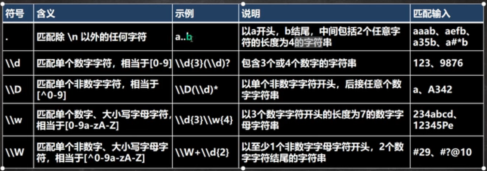
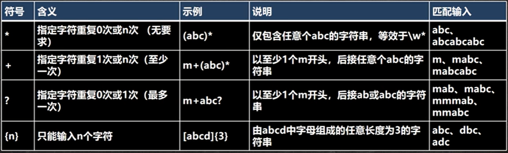
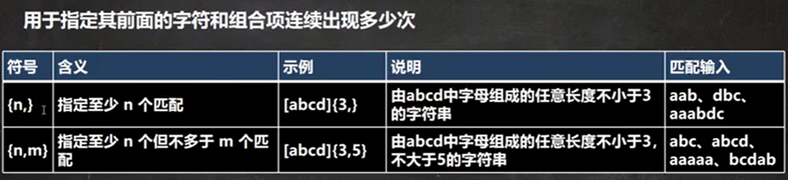
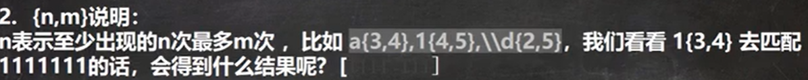
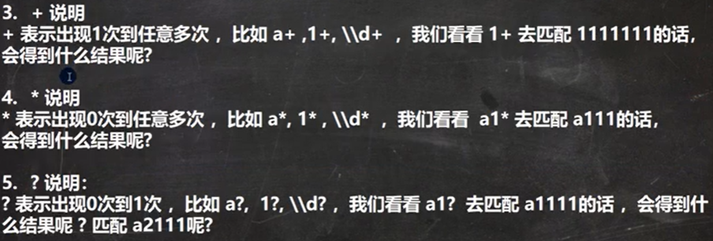
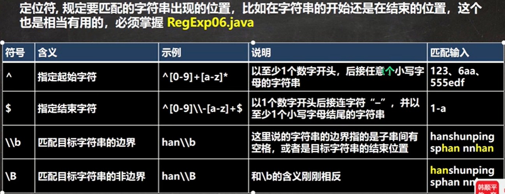
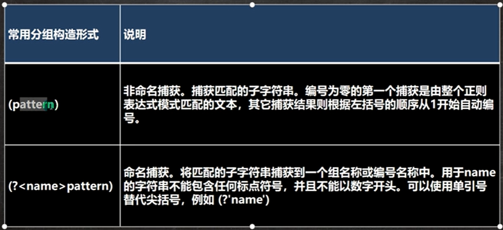
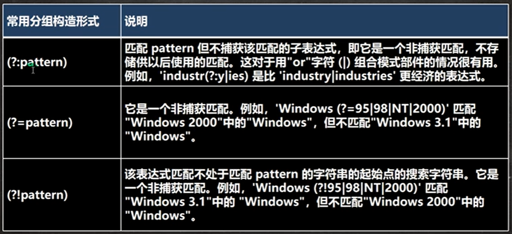

> Video：https://www.bilibili.com/video/BV1Eq4y1E79W
> 
>Author：韩顺平

## 为什么要学习正则表达式

正则表达式是对字符串执行模式匹配的技术

正则表达式： regular expression -> RegExp


## 正则表达式语法

- 基本介绍

如果要想灵活的运用正则表达式，必须了解其中各种元字符的功能，元字符从功能上大致分为:

1. 限定符
2. 选择匹配符
3. 分组组合和反向引用符
4. 特殊字符
5. 字符匹配符
6. 定位符

> \符号说明:在我们使用正则表达式去检索某些特殊字符的时候，需要用到转义符号，否则检索不到结果，甚至会报错的。案例:用$去匹配' abc$(" 会怎样?用(去匹配"abc$(" 会怎样?

> 再次提示：Java中正则表达式中，两个\\表示其他语言中的一个\

### 元字符：转义符\\

需要用到转义符号的字符有以下：. * + ( ) $ / \ ? [ ] ^ { }

### 元字符-字符匹配符

| 符号 | 符号             | 示例   | 解释                    |
| ---- | ---------------- | ------ | ----------------------- |
| []   | 可接收的字符列表 | [efgh] | efgh中的任意一个字符    |
| [^]  | 不接收的字符列表 | [^abc] | 除abc之外的任意一个字符 |
| -    | 连字符           | A-Z    | 任意单个大写字母        |



### 应用实例：

1. [a-z]说明:

  [a-z]表示可以匹配a-z中任意-个字符 ,比如[a-z]、[A-Z] 去匹配a11c8会得到什么结果?

2. java正则表达式默认是区分字母大小写的，如何实现不区分大小写

- (?i)abc表示abc都不区分大小写
- a(?i)bc表示bc不区分大小写
- a((?i)b)c表示只有b不区分大小写
- Pattern pat = Pattern.compile(regEx, Pattern.CASE INSENSITIVE);

3. [^a-z]说明:
\[^a-z\]表示可以匹配不是a-z中的任意一个字符 ,比如
我们看看\[^a-z\]去匹配a11c8 会得到什么结果? 用\[^a-z\]{2}又会得到什么结果呢?
\[^ A-Z\]表示可以匹配不是A-Z中的任意一个字符。
\[^0-9\]表示可以匹配不是0-9中的任意一个字符。
这个就不举例说明了.

4. [abcd] 表示可以匹配abcd中的任意一个字符。
5. \[^ abcd\]表示可以匹配不是abcd中的任意-个字符。
    当然上面的abcd你可以根据实际情况修改,以适应你的需求
6. \ld表示可以匹配0-9的任意一个数字,相当于 [0-9]。
7. \\\D表示可以四配不是0-9中的任意一个数字,相当于\[^0-9\]
8. \\\w匹配任意英文字符、数字和下划线,相当于[a-zA-Z0-9 ]
9. \\W相当于\[^a-zA-Z0-9 \]是\w刚好相反
10. \\\s匹配任何空白字符(空格,制表符等)
11. \\S匹配任何非空白字符,和\s刚好相反
12. 匹配出\n之外的所有字符,如果要匹配.本身则需要使用\\\\.

### 元字符-选择匹配符

在匹配某个字符串的时候是选择性的，即:既可以匹配这个，又可以匹配那个，这时你需要用到选择匹配符号 |

| 符号 | 符号                     | 示例   | 解释   |
| ---- | ------------------------ | ------ | ------ |
| \|   | 匹配\|之前或之后的表达式 | ab\|cd | ab或cd |

### 元字符-限定符

用于指定其前面的字符和组合项连续出现多少次





细节：java匹配默认贪婪匹配，即尽可能匹配多的





### 元字符-定位符



### 分组



- 非捕获分组



##  正则表达式三个常用类

- Pattern类

- Matcher类

- PatternSyntaxException

  是一个非强制异常类，它表示一个正则表达式模式中的语法错误

### Matcher类

```java
public int start(); //返回以前匹配的初始索引
public int start(int group); //返回在以前的匹配操作期间，由给定组所捕获的子序列的初始索引
public int end(); //返回最后匹配字符之后的偏移量
public int end(int group); //返回在以前的匹配操作期间，由给定组所捕获子序列的最后字符之后的偏移量
public boolean lookingAt(); //尝试将从区域开头开始的输入序列与该模式匹配
public boolean find(); //尝试查找与该模式匹配的输入序列的下一个子序列
public boolean find(int start); //重置此匹配器，然后尝试查找匹配该模式、从指定索引开始的输入序列的下一个子序列
public boolean matches(); //尝试将整个区域与模式匹配
```

## 分组 捕获 反向引用

问题：给你一段文本，请你找出所有四个数字连在一起的子串，并且这四个数字要满足

①第一位与四位相同

②第二位与三位相同

比如：1221,5775

要解决前面问题，我们需要了解正则表达式的几个概念：

1. 分组

   我们可以用圆括号组成一个比较复杂的匹配模式，那么一个圆括号的部分我们可以看作是一个子表达式、一个分组

2. 捕获

   把正则表达式中子表达式、分组匹配的内容，保存到内存中以数字编号或显式命名的组里，方便后面引用，从左向右，以分组的左括号为标志，第一个出现的分组的组号为1，第二个为2，以此类推。组0代表的是整个正则式。

3. 反向引用

   圆括号的内容被捕获后，可以在这个括号后被使用，从而写出一个比较实用的匹配模式，这个我么称之为反向引用，这种引用既可以是在正则表达式的内部，也可以是在正则表达式外部，内部反向引用\\\分组号，外部反向引用 $分组号

小案例：

1. 要匹配两个连续的相同数字：(\\\d)\\\1
2. 要匹配五个连续的相同数字：(\\\d)\\\1{4}
3. 要匹配个位与千位相同，十位与百位相同的数5225,1551：(\\\d)(\\\d)\\\2\\\1

## String类中使用正则表达式

- 替换功能

  ```java
  public String replaceAll(String regex, String replacement);
  ```

- 判断功能

  ```java
  public boolean matches(String regex)
  ```

- 分割功能

  ```java
  public String[] split(String regex)
  ```

## 作业

1. 1.验证电子邮件格式是否合法

   陆游:纸上得来总觉浅，绝知此事要躬行。做几个练习

   

规定电子邮件规则为

1. 只能有一个@
2. @前面是用户名,可以是a-z A-Z 0-9 - 字符
3. @后面是域名,并且域名只能是英文字母，比如sohu.com或者tsinghua.org.cn4.写出对应的正则表达式,验证输入的字符串是否为满足规则

